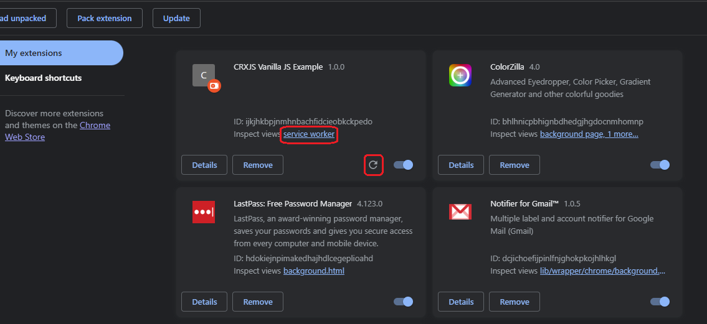

<h2>Motivation</h2>
Build a browser extension project with crxjs and use messages

<h2>vanilla-ts</h2>

<h3>Create project and show popup</h3>
follow <a href='https://crxjs.dev/vite-plugin/getting-started/vanilla-js/create-project'>this guide</a>
<ol>
<li>

choose typescript
```
npm init vite@latest
```

</li>
<li>

```
pnpm i @crxjs/vite-plugin
```

</li>
<li>
create vite.config.ts

```
export default defineConfig({
  plugins: [crx({ manifest })],
  server: {
    port: 5173,
    strictPort: true,
    hmr: {
      port: 5173,
    },
  },
})

```

remark : the server part was added due to an error 'Uncaught (in promise) SyntaxError: Failed to construct 'WebSocket': The URL 'ws://localhost:undefined/' is invalid.' after i clicked few times on the counter in the popup
</li>

<li>Install the extension in chrome</li>


<li>
invoke the following if the development server is not running

```
npm run dev
```

</li>
<li>open the extension in the chrome browser and index.html + imorted module will appear</li>
<li>change ts or css file and it will update instantly on the extension popup. This is called HMR</li>
</ol>

<h3>Add content script</h3>
continue with <a href='https://crxjs.dev/vite-plugin/getting-started/vanilla-js/add-content-script'>this guide</a>

<ol>
<li>add to manifest.json

```
{
  // other fields...
  "content_scripts": [
    {
      "js": ["src/content.ts"],
      "matches": ["https://www.google.com/*"]
    }
  ]
}
```

</li>

<li>create src/content.ts

```
import src from './lion-3576045_640.jpg'
import './content.css'

console.log('content.ts');
console.log(new Date());

const html = `
<div class="crx">
  
</div>
`

const doc = new DOMParser().parseFromString(html, 'text/html')
document.body.append(doc.body.firstElementChild!)

```

</li>

<li>navigate to www.google.com and see 'content.ts' and time in the console. check in google.com page bottom left and you will see the image !!!!!!!! no need to make any reload !!!!!!!!!!!</li>

<li>
invoke the following if the development server is not running

```
npm run dev
```

</li>
<li>check in google.com for the text 'Nathan Krasney - watch the lion image below' and lion image below</li>
</ol>


<h3>Add extension background</h3>

<ol>
<li>
add to manifest.json

```
{
  "background": {
    "service_worker": "src/background.ts",
    "type": "module"
  }
}
```
</li>

<li>add src/background.ts

```
console.log('background.ts');
console.log(new Date());

```

</li>

<li>
invoke the following if the development server is not running

```
npm run dev
```

</li>
<li>navigate to the extension page : click refresh icon and "service worker"




and you will see the console.log


</li>
</ol>


<h2>Hot Module Reload - HMR</h2>
<ul>
<li>You get HMR on change css and js in the extension while using 'npm run dev'</li><li>If you want to use it whith out HMR you need to create dist via 'npm run build'</li>
</ul>


<h2>Open issues</h2>
<ul>
<li>HMR is not working when background script is changing</li>
</ul>
